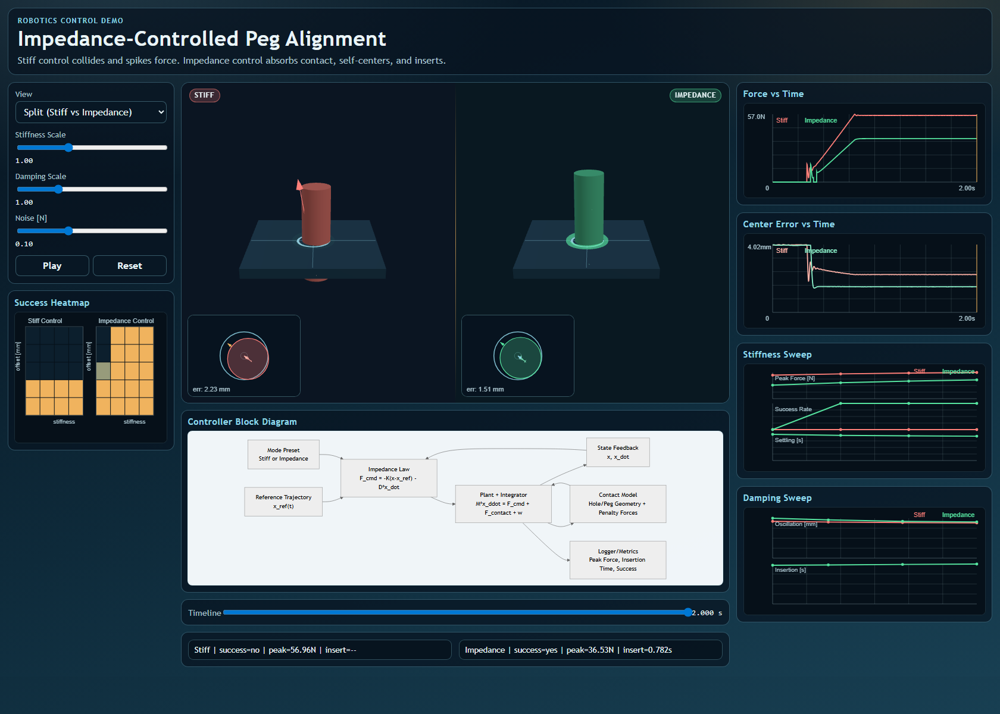
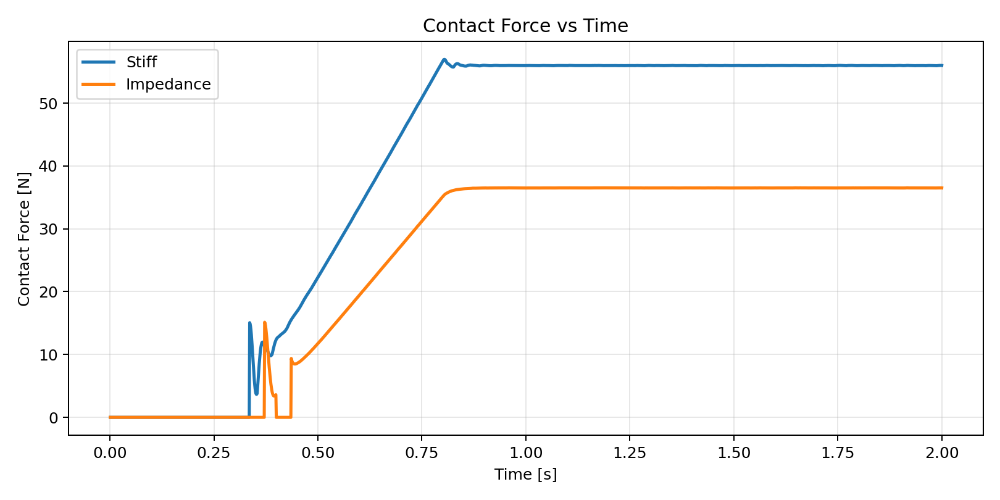
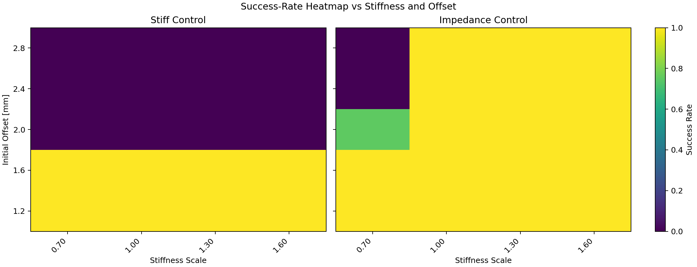

# Impedance-Controlled Peg Alignment Demo
MIT-style robotics control demo with a Python simulation backend and a Vite + Three.js interactive frontend.

Core insight in under 10 seconds:

> Stiff position control collides and spikes force, while impedance control absorbs contact, self-centers, and inserts.

## Why this project
This repo is a compact research-artifact style demonstration of Week 6 robotic control ideas:
- impedance control versus stiff position control
- contact transition behavior
- compliance and self-alignment under uncertainty
- quantitative robustness via sweeps and heatmaps

## Controller block diagram
<p>
  
</p>
[Open controller block diagram](./docs/assets/diagrams/controller_block.svg)
Source mermaid: `docs/assets/diagrams/controller_block.mmd`

## Screenshots
### Split-screen interactive demo (stiff left, impedance right, heatmap in left pane)
<p>
  
</p>
[Open image](./docs/assets/screenshots/app_split.png)

### Force comparison from benchmark output
<p>
  
</p>
[Open image](./docs/assets/screenshots/force_vs_time.png)

### Robustness heatmap
<p>
  
</p>
[Open image](./docs/assets/screenshots/robustness_heatmap.png)

## Quickstart
### 1) Generate canonical backend logs and validate behavior
```bash
python -m experiments.prepare_web_data --force-benchmark
```

This command:
- regenerates canonical `stiff` and `impedance` runs in `results/`
- validates expected behavior gates
- syncs data into `web/public/data/` for frontend playback

### 2) Run the frontend
```bash
cd web
npm install
npm run dev
```

`npm run dev` and `npm run build` automatically run `npm run sync-data` first, so frontend playback stays aligned with backend logs.

### 3) Run sweep benchmarks directly
```bash
# quick
python -m experiments.benchmark --quick --num-seeds 4 --seed-start 1

# full
python -m experiments.benchmark --num-seeds 6 --seed-start 1
```

Benchmark workflow purpose:
- quantitatively validate the control story (not only visual playback)
- measure where stiff control spikes/fails and where impedance remains robust

How to use this workflow:
1. Run `--quick` during iteration to sanity-check trends quickly.
2. Run full sweep for final reporting/portfolio evidence.
3. Review generated CSVs in `results/` for raw metrics.
4. Review generated figures in `plots/` for report-ready visuals.
5. If you want frontend plots updated from latest data, run:
`python -m experiments.prepare_web_data --force-benchmark`

Main outputs from benchmark workflow:
- `results/stiffness_sweep.csv`
- `results/damping_sweep.csv`
- `results/offset_robustness.csv`
- `results/noise_robustness.csv`
- `results/success_heatmap.csv`
- `results/force_spike_comparison.csv`

### 4) Reproduce representative comparison in notebook
Open and run:
`notebooks/demo.ipynb`

Notebook purpose:
- gives a one-file, reproducible analysis path for recruiters/reviewers
- regenerates canonical stiff vs impedance runs from backend code
- reproduces key evidence plots (force, center error, top-down path) without the UI
- serves as an audit trail that the visual story is backed by data

## Canonical default outcome
From `results/phase4_validation.json`:
- stiff: `success=False`, `peak_contact_force_n=56.96`
- impedance: `success=True`, `peak_contact_force_n=36.53`, `insertion_time_s=0.782`

## Deliverables by phase
- simulation core: `simulation/plant.py`, `simulation/controller.py`, `simulation/run_sim.py`
- experiments and plots: `experiments/benchmark.py`, `results/*.csv`, `plots/*.png`
- frontend MVP: `web/index.html`, `web/src/main.js`, `web/src/scene.js`, `web/src/ui.js`, `web/src/plots.js`
- integration sync: `experiments/prepare_web_data.py`
- theory and notebook: `docs/theory.md`, `notebooks/demo.ipynb`

## Repository layout
```text
impedance-contrller/
├── simulation/
├── experiments/
├── results/
├── plots/
├── web/
├── docs/
└── notebooks/
```

## Week 6 linkage
- spring-mass-damper impedance law in task space
- contact as an external interaction wrench/force
- hybrid free-space to contact transition
- compliance improving insertion robustness and reducing force spikes

## Limitations
- point-mass peg model (not full 6-DOF wrench-level manipulator model)
- penalty-based contact (no full friction cone, no stick-slip identification)
- no hardware loop or ROS2 streaming in this phase

## Next steps
- 6-DOF wrist impedance extension
- nonlinear friction and hybrid motion-force switching
- GLB/CAD realism upgrade for visualization phase 2
